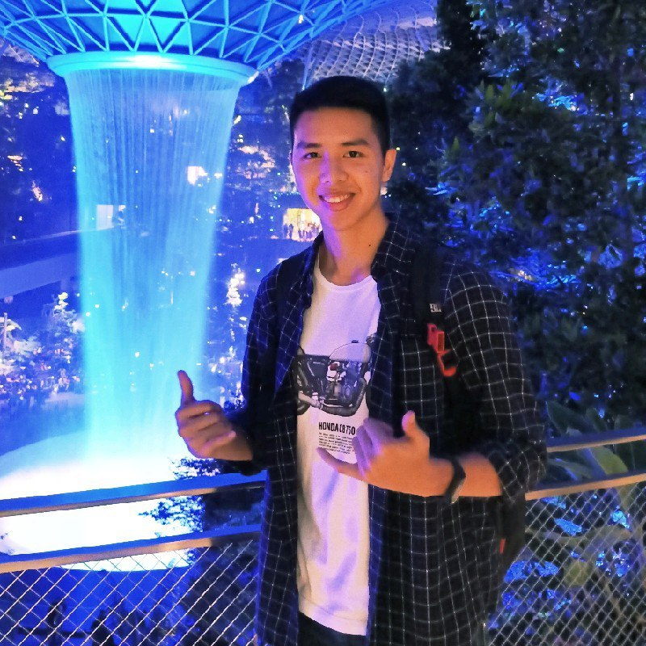
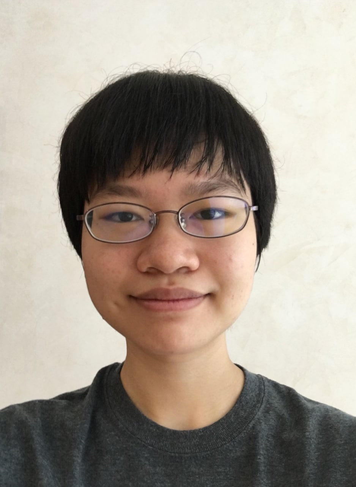
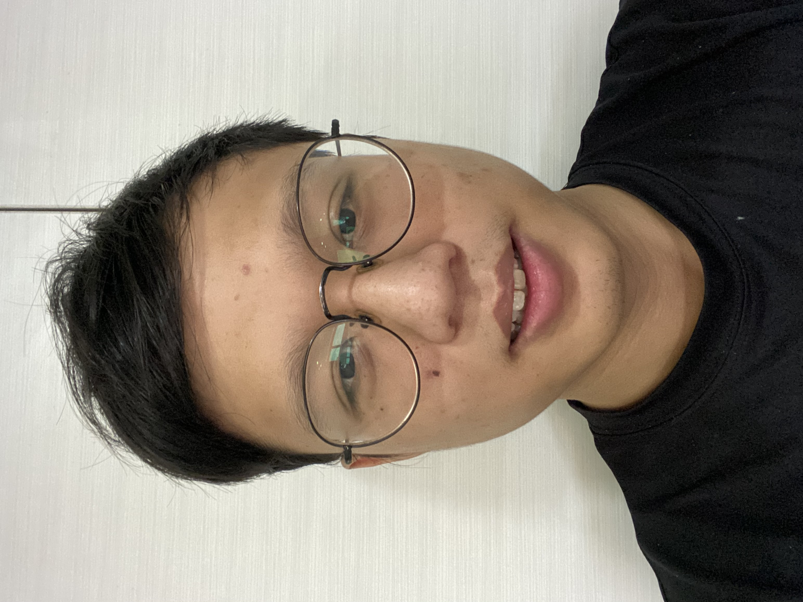
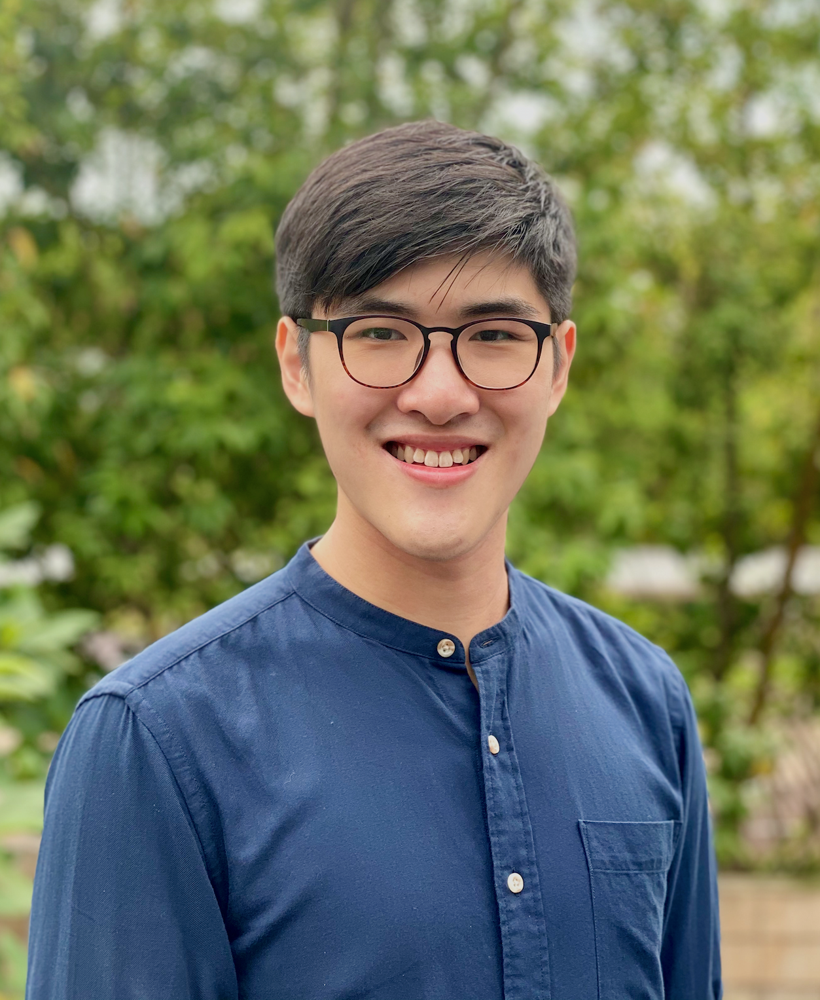

**SmartNUS** is a project built for CS2103T Software Engineering.

We are a team based in the [School of Computing, National University of Singapore](http://www.comp.nus.edu.sg).

## Project Team

### Abhishek Gupta

[[github](https://github.com/agentum07)]
[[portfolio](team/johndoe.md)]

* Role: Developer
* Responsibilities:

### Arya Nagatama Giat

[[github](http://github.com/aryagiat)]
[[portfolio](team/johndoe.md)]

* Role: Developer
* Responsibilities:

### Neo Jing Xuan

[[github](http://github.com/neojxuan)] [[portfolio](team/johndoe.md)]

* Role: Developer
* Responsibilities:

### Ong Jun Heng, Cedric

[[github](http://github.com/cedricongjh)]
[[portfolio](team/johndoe.md)]

* Role: Developer
* Responsibilities:

### Peh Kai Min, Ryan

[[github](http://github.com/ryanpeh)]
[[portfolio](team/johndoe.md)]

* Role: Developer
* Responsibilities: 
