* Table of Contents
{:toc}

--------------------------------------------------------------------------------------------------------------------

## **Acknowledgements**

* This project is based on the AddressBook-Level3 project by [SE-EDU initiative](https://se-education.org).

--------------------------------------------------------------------------------------------------------------------

## **Setting up, getting started**

Refer to the guide [_Setting up and getting started_](SettingUp.md).

--------------------------------------------------------------------------------------------------------------------

## **Design**

<div markdown="span" class="alert alert-primary">

:bulb: **Tip:** The `.puml` files used to create diagrams in this document can be found in the [diagrams](https://github.com/AY2122S1-CS2103T-F12-1/tp/blob/master/docs/diagrams/) folder. Refer to the [_PlantUML Tutorial_ at se-edu/guides](https://se-education.org/guides/tutorials/plantUml.html) to learn how to create and edit diagrams.
</div>

### Architecture


The ***Architecture Diagram*** given above explains the high-level design of the App.

Given below is a quick overview of main components and how they interact with each other.

**Main components of the architecture**

**`Main`** has two classes called [`Main`](https://github.com/AY2122S1-CS2103T-F12-1/tp/blob/master/src/main/java/seedu/smartnus/Main.java) and [`MainApp`](https://github.com/AY2122S1-CS2103T-F12-1/tp/blob/master/src/main/java/seedu/smartnus/MainApp.java). It is responsible for,
* At app launch: Initializes the components in the correct sequence, and connects them up with each other.
* At shut down: Shuts down the components and invokes cleanup methods where necessary.

[**`Commons`**](#common-classes) represents a collection of classes used by multiple other components.

The rest of the App consists of four components.

* [**`UI`**](#ui-component): The UI of the App.
* [**`Logic`**](#logic-component): The command executor.
* [**`Model`**](#model-component): Holds the data of the App in memory.
* [**`Storage`**](#storage-component): Reads data from, and writes data to, the hard disk.


**How the architecture components interact with each other**

The *Sequence Diagram* below shows how the components interact with each other for the scenario where the user issues the command `delete question 1`.


Each of the four main components (also shown in the diagram above),

* defines its *API* in an `interface` with the same name as the Component.
* implements its functionality using a concrete `{Component Name}Manager` class (which follows the corresponding API `interface` mentioned in the previous point.

For example, the `Logic` component defines its API in the `Logic.java` interface and implements its functionality using the `LogicManager.java` class which follows the `Logic` interface. Other components interact with a given component through its interface rather than the concrete class (reason: to prevent outside component's being coupled to the implementation of a component), as illustrated in the (partial) class diagram below.


The sections below give more details of each component.

### UI component

The **API** of this component is specified in [`Ui.java`](https://github.com/AY2122S1-CS2103T-F12-1/tp/blob/master/src/main/java/seedu/smartnus/ui/Ui.java)

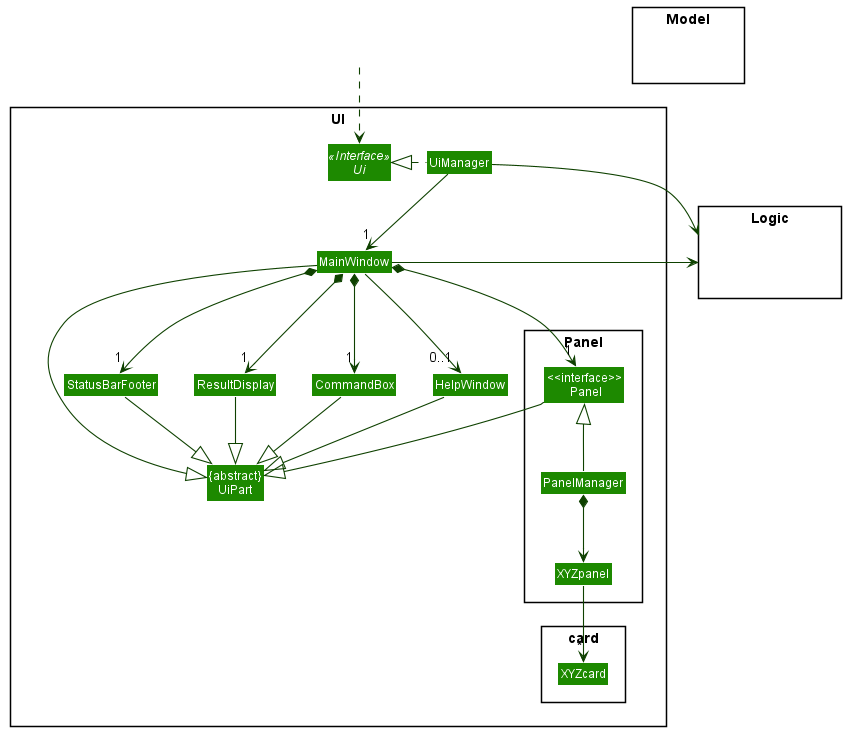

The UI consists of a `MainWindow` that is made up of parts e.g.`CommandBox`, `ResultDisplay`, `Panel`, `StatusBarFooter` etc. All these, including the `MainWindow`, inherit from the abstract `UiPart` class which captures the commonalities between classes that represent parts of the visible GUI.

The `UI` component uses the JavaFx UI framework. The layout of these UI parts are defined in matching `.fxml` files that are in the `src/main/resources/view` folder. For example, the layout of the [`MainWindow`](https://github.com/AY2122S1-CS2103T-F12-1/tp/blob/master/src/main/java/seedu/smartnus/ui/MainWindow.java) is specified in [`MainWindow.fxml`](https://github.com/AY2122S1-CS2103T-F12-1/tp/blob/master/src/main/resources/view/HelpWindow.fxml)

The `UI` component,

* executes user commands using the `Logic` component.
* listens for changes to `Model` data so that the UI can be updated with the modified data.
* keeps a reference to the `Logic` component, because the `UI` relies on the `Logic` to execute commands.
* depends on some classes in the `Model` component, as it displays `Question` object residing in the `Model`.

### Logic component

**API** : [`Logic.java`](https://github.com/AY2122S1-CS2103T-F12-1/tp/blob/master/src/main/java/seedu/smartnus/logic/Logic.java)

Here's a (partial) class diagram of the `Logic` component:

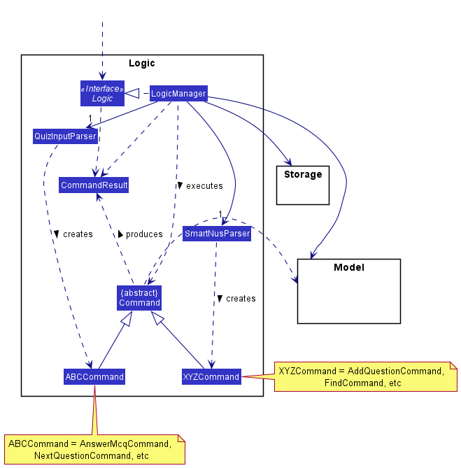

How the `Logic` component works:
1. When `Logic` is called upon to execute a command, it uses either the `SmartNusParser` or the `QuizInputParser` class to parse the user command, depending on which window the user is currently on (i.e. Main Window or Quiz Window).
1. This results in a `Command` object (more precisely, an object of one of its subclasses, `ABCCommand` or `XYZCommand`, which are placeholders for Commands created by `SmartNusParser` and `QuizInputParser` respectively e.g. `AddMcqCommand` created by `SmartNusParser` is a `XYZCommand`, while `AnswerMcqCommand` created by `QuizInputParser` is a `ABCCommand`) which is executed by the `LogicManager`.
1. The command can communicate with the `Model` when it is executed (e.g. to add a question for `AddMcqCommand`).
1. The result of the command execution is encapsulated as a `CommandResult` object which is then returned from `Logic`.

The Sequence Diagram below illustrates the interactions within the `Logic` component for the `execute("delete question 1")` API call.

[//]: # (TODO: Update the sequence diagram below, with sequence diagrams of main and quiz window stuff)


<div markdown="span" class="alert alert-info">:information_source: **Note:** The lifeline for `DeleteCommandParser` should end at the destroy marker (X) but due to a limitation of PlantUML, the lifeline reaches the end of diagram.
</div>

Here are some other classes in `Logic` (omitted from the class diagram above) that are used for parsing a user command:

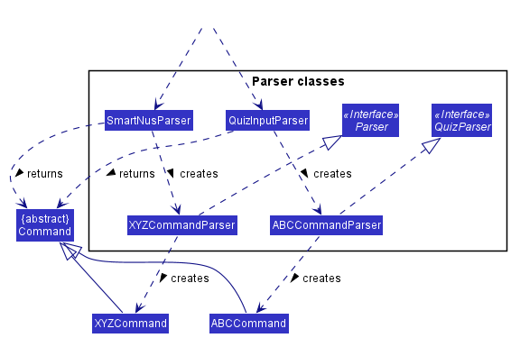

How the parsing works:
* When called upon to parse a user command, the `LogicManager` class will determine whether the `SmartNusParser` class or the `QuizInputParser` class will be used to parse the user command.
* The selected class it will create `XYZCommandParser` or `ABCCommandParser` (`XYZ` and `ABC` are placeholders for the specific command name created by `SmartNusParser` and `QuizInputParser` respectively e.g., `AddMcqCommandParser` and `AnswerMcqCommandParser`) which uses the other classes shown above to parse the user command and create a `XYZCommand` or `ABCCommand` object (e.g., `AddMcqCommand` or `AnswerMcqCommand`) which either `SmartNusParser` or `QuizInputParser` returns as a `Command` object.
    * All `XYZCommandParser` classes (e.g., `AddMcqCommandParser`, `DeleteCommandParser`, ...) inherit from the `Parser` interface so that they can be treated similarly where possible e.g, during testing.
    * All `ABCCommandParser` classes (e.g., `AnswerMcqCommandParser`, `AnswerTfqCommandParser`, ...) inherit from the `QuizParser` interface so that they can be treated similarly where possible e.g, during testing.

How the `Logic` component determines which parser to use:
- The `Logic` component uses either the `SmartNusParser` or the `QuizInputParser` class to parse the user command, depending on which window the user is currently on (i.e. Main Window or Quiz Window).
- Different parsers are used due to different commands being available to the user during the quiz (i.e. the user should not be able to execute `AddMcqCommand` while in a quiz).
- The `LogicManager` class achieves this through the usage of overloaded methods, `parseCommand(String)` and `parseCommand(String, QuizManager)`, with the latter for parsing commands while in a quiz.
- This was implemented with the consideration that the `QuizInputParser` would require a `QuizManager` argument to be passed to various `ABCCommandParser` and `Command` classes to carry out the necessary various quiz functionality.

### Model component
**API** : [`Model.java`](https://github.com/AY2122S1-CS2103T-F12-1/tp/blob/master/src/main/java/seedu/smartnus/model/Model.java)

Here's a (partial) class diagram of the `Model` component:

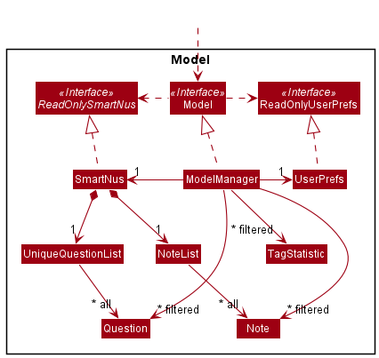


The `Model` component,

* stores the smartNUS data i.e., all [`Question`](#question-class) and [`Note`](#note-class) (which are contained in `UniqueQuestionList` and `NoteList` objects respectively).
* stores the currently 'selected' `Question` objects (e.g., results of a search query) as a separate _filtered_ list which is exposed to outsiders as an unmodifiable `ObservableList<Question>` that can be 'observed' e.g. the UI can be bound to this list so that the UI automatically updates when the data in the list changes.
* stores another list of the currently 'selected' `Question` objects for a `Quiz` as a separate _filtered_ list which is also exposed to outsiders as an unmodifiable `ObservableList<Question>` that can be used in the Quiz UI
* stores a list of the currently 'selected' `Note` objects as a separate _filtered_ list which is also exposed to outsiders as an unmodifiable `ObservableList<Note>` that can be 'observed' e.g. the UI can be bound to this list so that the UI automatically updates when the data in the list changes.
* stores a list of the currently 'selected' `TagStatistic` objects as a separate _filtered_ list which is also exposed to outsiders as an unmodifiable `ObservableList<TagStatistic>` that can be 'observed' e.g. the UI can be bound to this list so that the UI automatically updates when the data in the list changes.
* stores a `UserPref` object that represents the user’s preferences. This is exposed to the outside as a `ReadOnlyUserPref` objects.
* does not depend on any of the other three components (as the `Model` represents data entities of the domain, they should make sense on their own without depending on other components)

<div markdown="span" class="alert alert-info">:information_source: **Note:** An alternative (arguably, a more OOP) model is given below. It has a `Tag` list in the `SmartNus` model, which `Question` references. This allows `SmartNus` to only require one `Tag` object per unique tag, instead of each `Question` needing their own `Tag` objects.<br>


</div>

#### Question class

The `Question` class is an abstract class that stores a `Name`, `Importance`, `Statistic`, `Tag`s and `Choice`s.
A `Choice` stores a `title` String, a boolean value `isCorrect` representing if it is a correct answer to the `Question`,
and a Set of Strings representing `keywords` used for evaluating answers to Short Answer Questions.

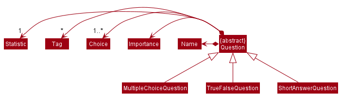

The validity of a `Question` depends on the type of question.
Types of Questions currently supported by SmartNUS, and their conditions for validity are:
1. Multiple Choice Questions
    * Has four `Choice`s in total, exactly one of which is correct
1. True-False Questions
    * Has two `Choice`s in total, which can only be "True" and "False", exactly one of which is correct
1. Short Answer Questions
    * Has one `Choice` in total which is correct and contains at least one `keyword`

#### Note class

The `Note` class is the class that stores a text - defined as a `NoteName`. The condition for validity of notes is:
* It should not be empty.

The notes are stored in a `NoteList` that represents a list of notes in which you can add notes, delete notes, or filter notes.
Here is a class diagram of the Notes class.

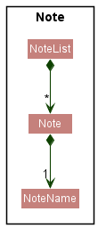

#### Statistic Class
The `Statistic` class is a class that keeps track of the user performance in answering the questions in a quiz.
The performance is tracked by:
* Number of attempts
* Number of correct attempts
```
performance = number of correct attempts / number of attempts
```

Here is a sequence diagram of answering a question correctly:

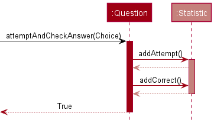

During a quiz, when a user answers a question, the `Statistic` of the `Question` is updated.
It will increment the number of attempts by 1 and also increment the number of correct attempts by 1
given that the user answered correctly. If the user does not answer correctly, the number of correct attempts does not increase.
Below is an activity diagram to show the process:

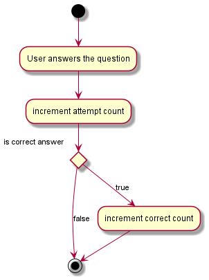

##### TagStatistic Class
The `TagStatistic` class inherits from the `Statistic` class. The `TagStatistic` class is specifically used to keep track of the statistics of each tags.

Here is the class diagram for `Statistic` and `TagStatistic`:

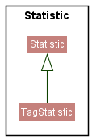


#### Quiz class

The `Quiz` class is an interface that is used to manage a quiz. A `Quiz` can get the current question, go to the next question, go to the previous question, attempt to answer the question, and get the `Statistic` of the `Quiz`.

The `QuizManager` class implements the `Quiz` interface. It manages the logic behind the quiz, and is created once a quiz is started.

Each `QuizManager` class stores the following information about the quiz:
* `questions`: A list of `Question` objects for all the questions in the quiz
* `currentIndex`: The current question index the user is currently at
* `selectedChoices`: A list of `Choice` objects used to keep track of the choices that the user has entered so far
* `statistic`: A `Statistic` object used to keep track of the statistics of the quiz

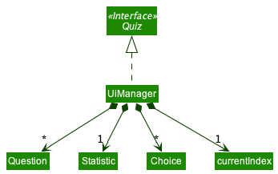

### Storage component

**API** : [`Storage.java`](https://github.com/AY2122S1-CS2103T-F12-1/tp/blob/master/src/main/java/seedu/smartnus/storage/Storage.java)

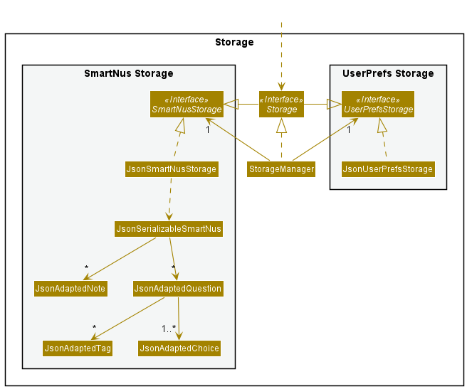

The `Storage` component,
* can save both SmartNus data and user preference data in json format, and read them back into their corresponding objects. (`Question` and `Note` objects)
* inherits from both `SmartNusStorage` and `UserPrefStorage`, which means it can be treated as either one (if only the functionality of only one is needed).
* depends on some classes in the `Model` component (because the `Storage` component's job is to save/retrieve objects that belong to the `Model`)

### Common classes

Classes used by multiple components are in the `seedu.smartnus.commons` package.

#### Theme Class
The `Theme` class is a class that stores the `css` file of a theme.
Currently, there are two available themes: `LightTheme` and `DarkTheme`which inherits from `Theme`:

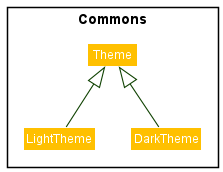

The `Theme` class is used by the `UI` component to update the theme and is stored in the `Model` component as a user preference.
The theme can be changed by executing the `ThemeCommand`.

--------------------------------------------------------------------------------------------------------------------

## **Implementation**

This section describes some noteworthy details on how certain features are implemented.

### Add question feature

#### Implementation

SmartNus deals with different question types (MCQ, TFQ, SAQ) each of which inherits from the same abstract `Question` class, as detailed in the [`Question`](#question-class) section.

Adding of questions is done through calling the `execute` method of the `AddQuestionCommand`.

The relevant classes, part of the [`Logic`](#logic-component) component, are shown in the class diagram below:

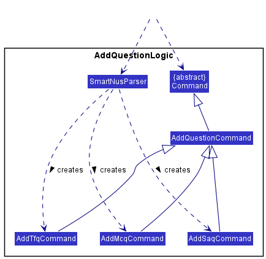

* `AddSaqCommand`, `AddTfqCommand` and `AddMcqCommand` inherits from `AddQuestionCommand`, which inherits from the abstract `Command` class.
* `AddQuestionCommand` implements the `execute` method as required by the `Command` abstract class, which adds a question to SmartNus.
* `AddSaqCommand`, `AddTfqCommand` and `AddMcqCommand` all have the same `execute` method. (i.e. They do not override `AddQuestionCommand#execute`)
* `SmartNusParser` creates the appropriate subtype (`AddSaqCommand`, `AddTfqCommand` or `AddMcqCommand`) of `AddQuestionCommand` based on the user's input. (e.g. User tells SmartNus to add an `mcq` question, `AddMcqCommand` is created by `SmartNusParser`, the same goes for the other question types)

The sequence diagram below illustrates how a `tfq` is added to SmartNus:

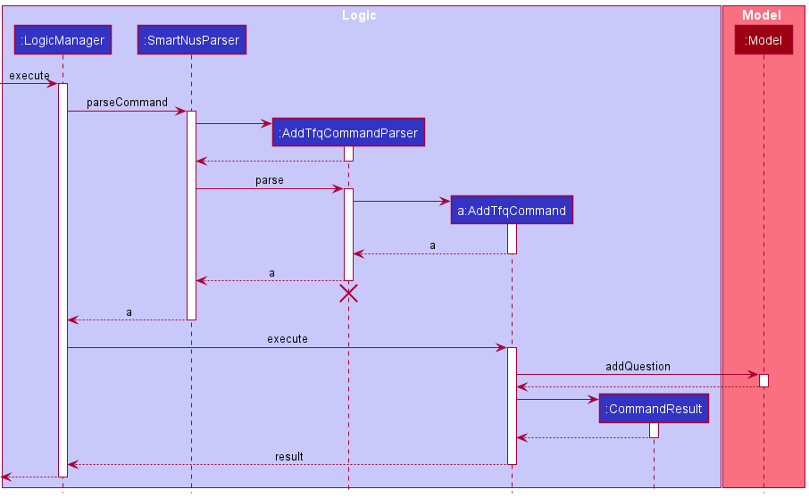

<div markdown="span" class="alert alert-info">:information_source: **Note:** The lifeline for `AddTfqCommandParser` should end at the destroy marker (X) but due to a limitation of PlantUML, the lifeline reaches the end of diagram.
</div>


Here's how the tfq is added:

1. When `Logic` is called upon to `execute` the add tfq command (e.g. `tfq qn/ Is 1+1 = 2 ans/T i/1`), it uses a `SmartNusParser` to parse the command via the `parseCommand` method, returning a `AddTfqCommandParser`.
2. The `SmartNusParser` calls the `parse` method of `AddTfqCommandParser`, which returns a `AddTfqCommand`.
3. The `LogicManager` calls the `execute` method of `AddTfqCommand`, which then calls the `addQuestion` method of the model to add the tfq to SmartNus.

<div markdown="span" class="alert alert-info">:information_source: **Note:**  This applies to the other question types as well, e.g. for adding an mcq, `AddMcqCommandParser` will be returned by `SmartNusParser`, which then returns `AddMcqCommand` upon parsing the user's input.
</div>

### Find questions feature

The find questions feature allows users to search for `Question`s by three parameters: name, tags and importance.

#### Implementation
The find questions feature is implemented using `FindCommandParser`, `FindCommand` and `Predicate`s that implement the `Predicate<Question>` interface.
Given below is a class diagram of the main classes involved in the implementation of this feature.

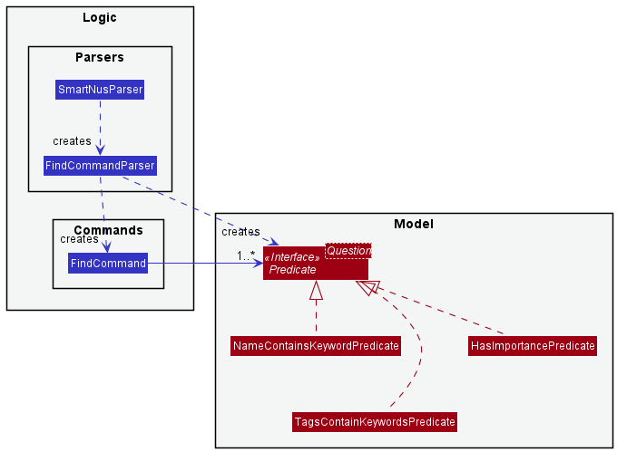

The FindCommandParser parses the user input into predicates that the `Question`s must match to be included in the `FilteredQuestionList`.
Each condition is represented by a predicate that extends from `Predicate<Question>`. The three search parameters in the user input, name, tags and importance,
are parsed and used to create the `NameContainsKeywordsPredicate`, `TagsContainKeywordsPredicate` and `HasImportancePredicate` respectively.

| Predicate | Function                                |
| -------- | ------------------------------------------ |
|`NameContainsKeywordsPredicate` | Checks if a `Question`'s `Name` contains all the given keywords |
|`TagsContainKeywordsPredicate`| Checks if a `Question` contains at least one `Tag`s whose name matches a keywords |
|`HasImportancePredicate`| Checks if a `Question` has a particular `Importance` value |

These predicates are passed from the `FindCommandParser` to the `FindCommand`.
`FindCommand` composes these predicates into a logical AND of all predicates. When the `FindCommand` is executed,
it updates the `FilteredQuestionList` with `Question`s that match this composed predicate, and hence satisfy all the
user’s search conditions. Given below is a sequence diagram that shows the execution of a FindCommand when a user
executes `find t/CS2103T`.

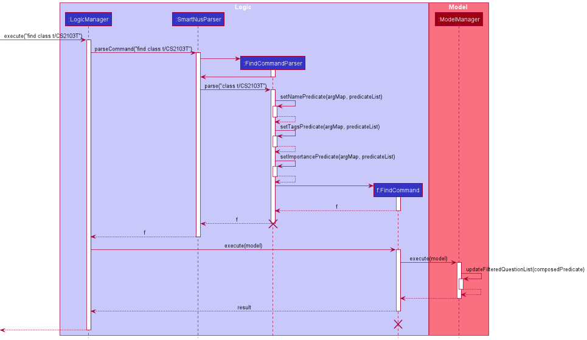

#### Proposed Extensions
The find feature currently only supports finding questions. It can be extended to search for both `Question`s and `Note`s.
Here is the proposed implementation of such a feature:
1. The `FindCommandParser` will take in an additional
   parameter, either "note" or "question".
2. Depending on which item the user wants to search for, the `FindCommandParser`
   will create a `FindNoteParser` or a `FindQuestionParser`.
3. The parsers will parse user inputs into either `Predicate<Note>`
   or `Predicate<Question>`, depending on the item that the user is searching for.
4. If the user is searching for `Note`s, a `FindNoteCommand` will be generated. If the user is searching for `Question`s, a `FindQuestionCommand` is created.
   The activity diagram below illustrates this implementation.

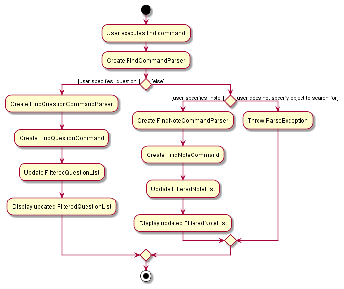

### Change Theme Feature
The `Theme` class is used by the `UI` component to update the theme and is stored in the `Model` component as a user preference.
The theme can be changed by executing the `ThemeCommand`.

Here is a sequence diagram when the `ThemeCommand` is executed with a given `Theme` object called `theme` inside the `ThemeCommand`. Currently the `theme` object can either be a `LightTheme` or `DarkTheme`

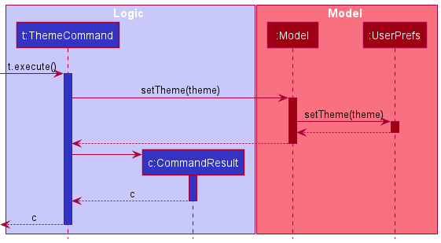

Once a `Theme` is kept inside the `Model`, the `UI` component can fetch the `Theme` and render it accordingly:

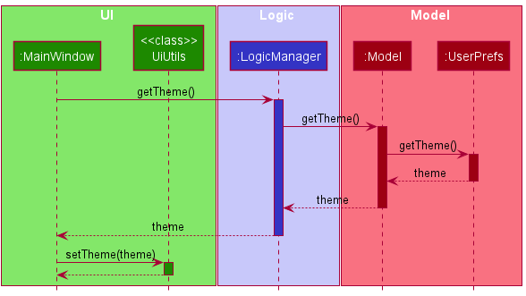

The reason why a `Theme` is kept inside the `Model`'s `UserPrefs` is because it allows the current theme to be saved in the storage as a user preference.
Without saving it in the storage, the user will have to keep changing the theme every time the user opens the app.

### Quiz feature

All features related to the quiz functionality.

#### Starting a quiz

The start quiz feature allows users to start a quiz from the main window.

##### Implementation

The quiz feature is facilitated by `MainWindow`, `LogicManager`, `SmartNusParser` and `QuizCommand`. Given below is an example usage scenario of how the start quiz mechanism behaves at each step.

1. User input `quiz lim/5` from `MainWindow` class in the Ui component is passed to the `LogicManager#execute()` method.
2. `LogicManager` will then call `SmartNusParser#parserCommand()`, which will create a `QuizCommandParser`.
3. Additionally, `SmartNusParser` will then call the `QuizCommandParser#parse()` method to parse the arguments `lim/5`, which will create a `QuizCommand`.
4. `QuizCommand#execute()` will be invoked by `LogicManager` to execute the command, which will then call `Model#updateFilteredQuizQuestionList()` to update the questions in the `Model`.
5. The `CommandResult` is then returned back to `MainWindow` which will then create a new `QuizWindow` to be displayed.

Below is the sequence diagram to show how the quiz is started.

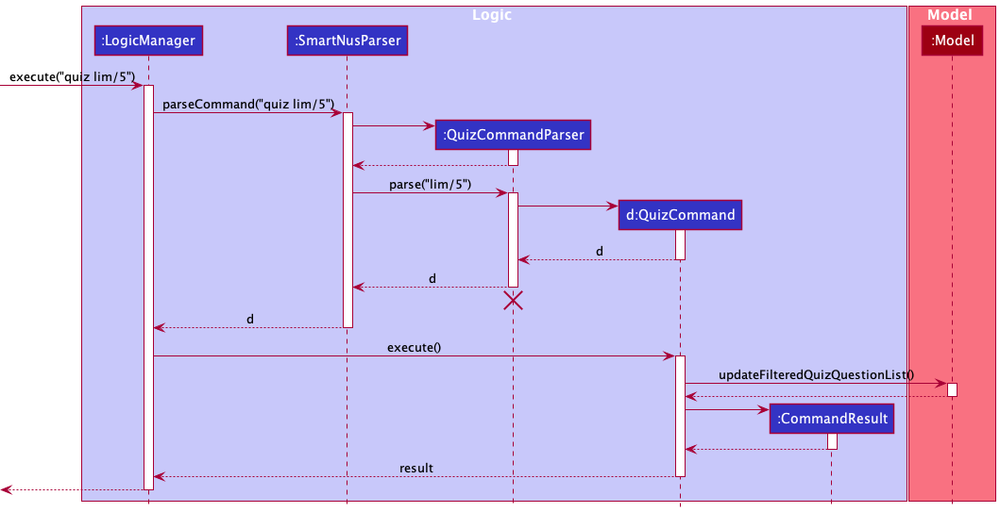

#### Parsing of user input

As different commands are available to the user at the `QuizWindow` and the `MainWindow`, it is necessary to determine which commands are valid for the user to execute based on which window the user is at.

#### Answering of questions

The answering of questions feature allows users to select their desired choice for questions during a quiz.

##### Implementation

Given below is an example usage scenario of how the mechanism of answering a multiple choice question behaves at each step.

1. User input `A` and the `QuizManager` object from the `QuizWindow` class in the Ui component are passed to the `LogicManager#execute()` method.
1. `LogicManager` will then call `QuizInputParser#parserCommand()`, which will create a `AnswerMcqCommandParser`.
1. Additionally, `QuizInputParser` will then call the `AnswerMcqCommandParser#parse()` method to parse the arguments `A` and the `QuizManager` object, which will create a `AnswerMcqCommand`.
1. `AnswerMcqCommand#execute()` will be invoked by `LogicManager` to execute the command, which will then call `QuizManager#answerAndCheckAnswer()` to update choices in `QuizManager`.
1. The `CommandResult` is then returned back to `QuizWindow` which will update the Ui with the updated message and the selected choice.

Below is the sequence diagram to show how a multiple choice question is answered.

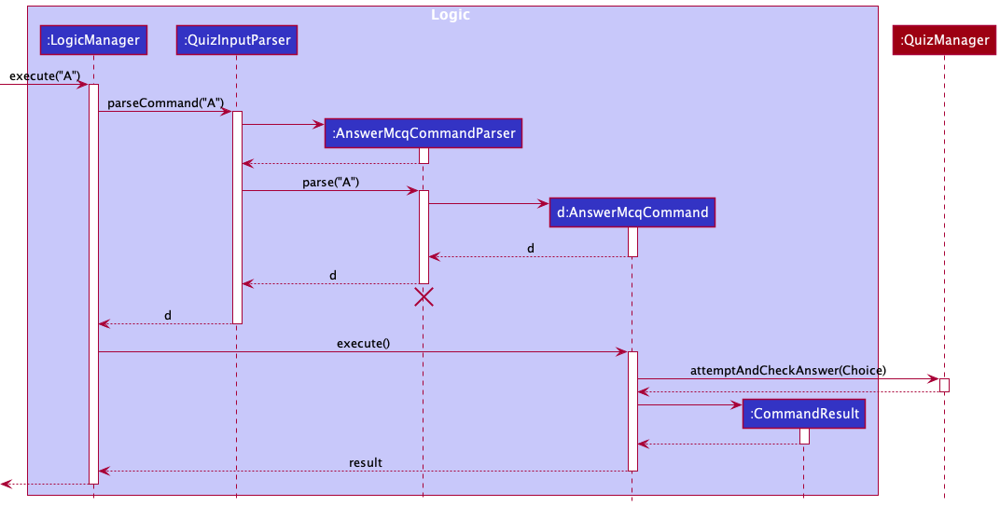

#### Next question

The next question feature allows users to proceed to the next question during a quiz.

##### Implementation

Given below is an example usage scenario of how the mechanism of proceeding to the next question behaves at each step.

1. User input `next` and the `QuizManager` object from the `QuizWindow` class in the Ui component are passed to the `LogicManager#execute()` method.
1. `LogicManager` will then call `QuizInputParser#parserCommand()`, which will create a `NextQuestionCommand`.
1. `NextQuestionCommand#execute()` will be invoked by `LogicManager` to execute the command, which will then call `QuizManager#nextQuestion()` to update the current question index in `QuizManager`.
1. The `CommandResult` is then returned back to `QuizWindow` which will update the Ui with the updated message and question.

Below is the sequence diagram to show how the next question is shown.


### \[Proposed\] Undo/redo feature

#### Proposed Implementation

The proposed undo/redo mechanism is facilitated by `VersionedSmartNus`. It extends `SmartNus` with an undo/redo history, stored internally as an `smartNusStateList` and `currentStatePointer`. Additionally, it implements the following operations:

* `VersionedSmartNus#commit()` — Saves the current smartNus state in its history.
* `VersionedSmartNus#undo()` — Restores the previous smartNus state from its history.
* `VersionedSmartNus#redo()` — Restores a previously undone smartNus state from its history.

These operations are exposed in the `Model` interface as `Model#commitSmartNus()`, `Model#undoSmartNus()` and `Model#redoSmartNus()` respectively.

Given below is an example usage scenario and how the undo/redo mechanism behaves at each step.

Step 1. The user launches the application for the first time. The `VersionedSmartNus` will be initialized with the initial smartNus state, and the `currentStatePointer` pointing to that single smartNus state.

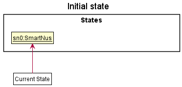

Step 2. The user executes `delete 5` command to delete the 5th question in the smartNus. The `delete` command calls `Model#commitSmartNus()`, causing the modified state of the smartNus after the `delete 5` command executes to be saved in the `SmartNusStateList`, and the `currentStatePointer` is shifted to the newly inserted smartNus state.

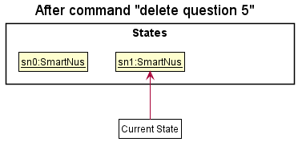

Step 3. The user executes `add n/David …​` to add a new question. The `add` command also calls `Model#commitSmartNus()`, causing another modified smartNus state to be saved into the `smartNusStateList`.

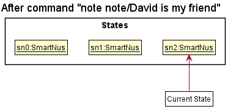

<div markdown="span" class="alert alert-info">:information_source: **Note:** If a command fails its execution, it will not call `Model#commitSmartNus()`, so the smartNus state will not be saved into the `smartNusStateList`.

</div>

Step 4. The user now decides that adding the question was a mistake, and decides to undo that action by executing the `undo` command. The `undo` command will call `Model#undoSmartNus()`, which will shift the `currentStatePointer` once to the left, pointing it to the previous smartNus state, and restores the smartNus to that state.

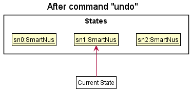

<div markdown="span" class="alert alert-info">:information_source: **Note:** If the `currentStatePointer` is at index 0, pointing to the initial SmartNus state, then there are no previous SmartNus states to restore. The `undo` command uses `Model#canUndoSmartNus()` to check if this is the case. If so, it will return an error to the user rather
than attempting to perform the undo.

</div>

The following sequence diagram shows how the undo operation works:

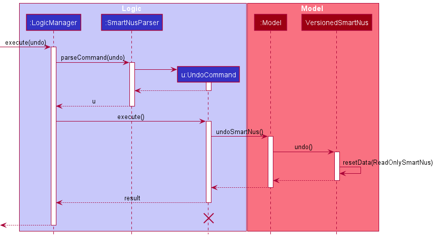

<div markdown="span" class="alert alert-info">:information_source: **Note:** The lifeline for `UndoCommand` should end at the destroy marker (X) but due to a limitation of PlantUML, the lifeline reaches the end of diagram.

</div>

The `redo` command does the opposite — it calls `Model#redoSmartNus()`, which shifts the `currentStatePointer` once to the right, pointing to the previously undone state, and restores the smartNus to that state.

<div markdown="span" class="alert alert-info">:information_source: **Note:** If the `currentStatePointer` is at index `smartNusStateList.size() - 1`, pointing to the latest smartNus state, then there are no undone SmartNus states to restore. The `redo` command uses `Model#canRedoSmartNus()` to check if this is the case. If so, it will return an error to the user rather than attempting to perform the redo.

</div>

Step 5. The user then decides to execute the command `list`. Commands that do not modify the smartNus, such as `list`, will usually not call `Model#commitSmartNus()`, `Model#undoSmartNus()` or `Model#redoSmartNus()`. Thus, the `smartNusStateList` remains unchanged.

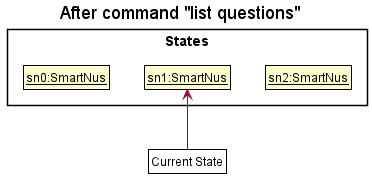

Step 6. The user executes `clear`, which calls `Model#commitSmartNus()`. Since the `currentStatePointer` is not pointing at the end of the `smartNusStateList`, all smartNus states after the `currentStatePointer` will be purged. Reason: It no longer makes sense to redo the `add n/David …​` command. This is the behavior that most modern desktop applications follow.

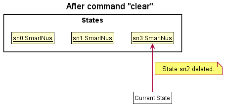

The following activity diagram summarizes what happens when a user executes a new command:


#### Design considerations:

**Aspect: How undo & redo executes:**

* **Alternative 1 (current choice):** Saves the entire smartNus.
  * Pros: Easy to implement.
  * Cons: May have performance issues in terms of memory usage.

* **Alternative 2:** Individual command knows how to undo/redo by
  itself.
  * Pros: Will use less memory (e.g. for `delete`, just save the question being deleted).
  * Cons: We must ensure that the implementation of each individual command are correct.

_{more aspects and alternatives to be added}_

### \[Proposed\] Data archiving

_{Explain here how the data archiving feature will be implemented}_


--------------------------------------------------------------------------------------------------------------------

## **Documentation, logging, testing, configuration, dev-ops**

* [Documentation guide](Documentation.md)
* [Testing guide](Testing.md)
* [Logging guide](Logging.md)
* [Configuration guide](Configuration.md)
* [DevOps guide](DevOps.md)

--------------------------------------------------------------------------------------------------------------------

## **Appendix: Requirements**

### Product scope

**Target user profile**:

* needs to organise and revise materials for many modules
* wants to note down important information in the form of questions and answers that they can quiz themselves on
* prefer desktop apps over other types
* can type fast
* prefers typing to mouse interactions
* is reasonably comfortable using CLI apps

**Value proposition**: organise and revise information faster than a typical mouse/GUI driven app


### User stories

Priorities: High (must have) - `* * *`, Medium (nice to have) - `* *`, Low (unlikely to have) - `*`

| Priority | As a …​                                    | I want to …​                     | So that I can…​                                                        |
| -------- | ------------------------------------------ | ------------------------------ | ---------------------------------------------------------------------- |
| `* * *`  | NUS Student | add a multiple choice question to the topic         | review the question in MCQ style|
| `* * *`  | NUS Student | add an answer to the multiple choice question       | see the correct answer during the review                                                                        |
| `* * *`  | NUS Student | add a note to remember things about mods | remember points about modules|
| `* * *`  | NUS Student | delete the question and at the same time delete all answers belonging to that question | remove questions and answer that are not needed|
| `* * *`  | NUS Student | do a quiz containing only questions from a certain tag       | revise questions for the specific tag|
| `* * *`  | NUS Student | specify the number of questions to be included in any quiz| revise the number of questions taking into account time constraints or the importance I place on that module/topic, rather than having to go through all questions|
| `* * *`  | NUS Student | see the list of all commands | know what commands to use to perform a specific task that I want|
| `* * *`  | NUS Student | specify the number of questions to be included in any quiz| revise the number of questions taking into account time constraints or the importance I place on that module/topic, rather than having to go through all questions|
| `* * *`  | NUS Student | add tags | tag questions to categorise them and search through them easily|
| `* * *`  | NUS Student | delete existing tag | delete unneeded tags|
| `* * *`  | NUS Student | add a True or False question to the topic | review the question in T/F style|
| `* * *`  | NUS Student | add an open ended question to the topic | review the question open endedly|
| `* * *`  | NUS Student | add an answer to the True or False question | see the correct answer during the review|
| `* * *`  | NUS Student | add an answer to the open ended question | see the correct answer during the review|
| `* * *`  | NUS Student | tag questions with custom tags (e.g. midterm, quiz, finals) | mark questions (add a note)|
| `* *`    | NUS Student | end the quiz mid way | end the quiz without finishing it, and return to question list|
| `* * `   | NUS Student | search questions by tag | filter out questions based on the specific tags|
| `* * `   | NUS Student | search questions by keyword | filter out questions based on the specific keyword|
| `* *`    | NUS Student | update existing tag | change a tag if there is a typo|
| `* *`    | NUS Student | edit the multiple choice question | amend the question just in case I made a mistake |
| `* *`    | NUS Student | edit the True or False question | amend the question just in case I made a mistake |
| `* *`    | NUS Student | edit the open ended question | amend the question just in case I made a mistake |
| `* *`    | NUS Student | edit the multiple choice answer | amend the answer just in case I made a mistake |
| `* *`    | NUS Student | edit the True or False answer | amend the answer just in case I made a mistake |
| `* *`    | NUS Student | edit the open ended answer | amend the answer just in case I made a mistake |
| `* *`    | NUS Student | mark a review as correct | track which questions I answered correctly |
| `* *`    | NUS Student | mark a review as incorrect | track which questions I need to review again |
| `*`      | NUS Student | undo a command | undo something that I did carelessly |
| `*`      | NUS Student | add an exam date to a tag | prioritize which modules to study for |
| `*`      | NUS Student | view how many times I have answered any question correctly and incorrectly | identify areas of improvement to focus on during revision|
| `*`      | NUS Student | view how many times I have answered questions from a particular topic correctly and incorrectly| identify areas of improvement to focus on during revision|
| `*`      | NUS Student | have Demo data already in the application [modules, QnA, tags]| see how the application works and try it out easily|
| `*`      | NUS Student | create a deadline (date) for the selected topic| manage my time to review topics|
| `*`      | NUS Student | view deleted questions | still see the questions I might need but have deleted|
| `*`      | NUS Student | restore deleted questions | to restore questions that I deleted but need again|
| `*`      | NUS Student | delete everything and start fresh | get rid of all data I have entered so far|
| `*`      | NUS Student | go back or forward in the question list | review again the questions I have answered |


### Use cases

(For all use cases below, the **System** is the `SmartNUS` and the **Actor** is the `user`, unless specified otherwise)


**Use case: List questions**

**MSS**

1.  User requests to list questions.
2.  SmartNUS displays a list of all stored questions.

**Extensions**

* 1a. User does not specify the keyword `question`.
* SmartNUS shows error message.

  Use case ends.

**Use case: List notes**

**MSS**

1.  User requests to list notes.
2.  SmartNUS displays a list of all stored notes.

**Extensions**

* 1a. User does not specify the keyword `note`.
* SmartNUS shows error message.

  Use case ends.

**Use case: List tag**

**MSS**

1.  User requests to list tag.
2.  SmartNUS displays a list of all stored tags.

**Extensions**

* 1a. User does not specify the keyword `tag`.
* SmartNUS shows error message.

  Use case ends.


**Use case: Add Multiple Choice question and options**

**MSS**

1.  User requests to add an MCQ question and its options, indicating the correct answer.
2.  SmartNUS saves the question, its options and the correct answer.

**Extensions**

* 1a. User does not specify any options.
  * SmartNUS shows error message.

    Use case ends.

* 1b. User does not specify the correct answer.
  * SmartNUS shows error message.
  
    Use case ends.

* 1c. User specifies more than 3 incorrect options.
  * SmartNUS shows error message.

    Use case ends.


**Use case: Add True/False question**

**MSS**

1.  User requests to add a True/False question, indicating the correct answer.
2.  SmartNUS saves the question and the correct answer.

**Extensions**

* 1a. User does not specify the correct answer.
    * 1a1. SmartNUS shows error message.

      Use case ends.

* 1b. User specifies a blank answer.
    * 1b1. SmartNUS shows error message.

      Use case ends.

**Use case: Add Short Answer question**

**MSS**

1.  User requests to add a Short Answer question, indicating the correct answer and keywords.
2.  SmartNUS saves the question, the correct answer and keywords.

**Extensions**

* 1a. User does not specify the correct answer.
    * SmartNUS shows error message.

    Use case ends.

* 1b. User specifies an answer without keywords.
    * SmartNUS shows error message.

    Use case ends.


**Use case: Delete a question**

**MSS**

1. User requests to list questions.
2. SmartNUS shows a list of all questions.
3. User requests to delete a specific question in the list.
4. SmartNUS deletes the question.

   Use case ends.

**Extensions**

* 2a. The list is empty.
    * 2a1. SmartNUS shows message that there are no questions.

      Use case ends.

* 3a. The given index is invalid.
    * 3a1. SmartNUS shows an error message.

      Use case resumes at Step 2.

**Use case: Delete a note**

**MSS**

1. User requests to list notes.
2. SmartNUS shows a list of all notes.
3. User requests to delete a specific note in the list.
4. SmartNUS deletes the note.

   Use case ends.

**Extensions**

* 2a. The list is empty.
    * 2a1. SmartNUS shows message that there are no notes.

      Use case ends.

* 3a. The given index is invalid.
    * 3a1. SmartNUS shows an error message.

      Use case resumes at Step 2.

**Use case: Find questions**

**MSS**

1. User requests to list questions containing specific keywords, tags and/or importance.
2. SmartNUS shows a list of questions that contain all the keywords, at least one of the tags and the importance value
   (if these parameters are specified).

**Extensions**

* 1a. User does not specify any parameters (keywords, tags and importance).
    * 1a1. SmartNUS shows an error message.

  Use case ends.

* 1b. User specifies tag names that are not alphanumeric.
    * 1b1. SmartNUS shows an error message.

  Use case ends.

* 1c. User specifies an invalid importance value.
    * 1c1. SmartNUS shows an error message.

    Use case ends.

* 2a. There are no questions in SmartNUS that satisfy the user's search conditions.
    * 2a1. SmartNUS shows message that there are no questions.

      Use case ends.

**Use case: Edit a question**

**MSS**

1. User requests to list questions.
2. SmartNUS shows a list of all questions.
3. User requests to edit a specific question in the list with new values.
4. SmartNUS updates the question's details to those specified by the user.

   Use case ends.

**Extensions**

* 2a. The list is empty.
    * 2a1. SmartNUS shows message that there are no questions.

      Use case ends.

* 3a. The given index is invalid.
    * 3a1. SmartNUS shows an error message.

      Use case resumes at Step 2.

* 3b. The values provided by the user to update the question are invalid.
    * 3b1.  SmartNUS shows an error message.

      Use case resumes at Step 2.


**Use case: Start a quiz**

**MSS**

1.  User requests to start a quiz, specifying number of questions and tags.
2.  SmartNUS shows a question from one of the specified tags and its options.
3.  User chooses one option.
4.  SmartNUS shows the correct option (answer).
5.  Steps 2 to 4 are repeated until the user has answered the number of questions he/she specified when starting the quiz.
6.  SmartNUS shows the user’s score (number of questions correct and total number of questions answered).

**Extensions**

* 1a. Number of questions is invalid (negative or more than total number of questions).
    * 1a1. SmartNUS shows error message.

      Use case ends.

* 1b. At least one tag does not exist.
    * 1b1. SmartNUS shows an error message.

      Use case ends.

* 2a. User did not specify any tags.
    * 2a1. SmartNUS shows any question (that has not yet been shown in the quiz) and its options.

      Use case resumes at Step 3.

* 5a. User did not specify number of questions.
    * 5a1. Steps 2 to 4 are repeated until all questions from the specified tags have been shown.

      Use case resumes at Step 6.


### Non-Functional Requirements

1. Should work on any _mainstream OS_ as long as it has Java `11` or above installed.
2. Should be able to hold up to 500 questions and 500 notes without a noticeable sluggishness in performance for typical usage.
3. A student with above average typing speed for regular English text (i.e. not code, not system admin commands) should be able to accomplish most of the tasks faster using commands than using the mouse.
4. The data should be stored locally and should be in an editable json file.
5. The product should be for a single user at a time.
6. The final product should be a result of morphing the given AB3 code base.
7. The final product should be self-contained i.e should not prompt the user to open any links.
8. The final product should be fully functional without the internet.

### Glossary

* **Mainstream OS**: Windows, Linux, Unix, OS-X

--------------------------------------------------------------------------------------------------------------------

## **Appendix: Instructions for manual testing**

Given below are instructions to test the app manually.

<div markdown="span" class="alert alert-info">:information_source: **Note:** These instructions only provide a starting point for testers to work on;
testers are expected to do more *exploratory* testing.

</div>

### Launch and shutdown

1. Initial launch

2. Download the jar file and copy into an empty folder

  3. Double-click the jar file Expected: Shows the GUI with a set of sample contacts. The window size may not be optimum.

4. Saving window preferences

    1. Resize the window to an optimum size. Move the window to a different location. Close the window.

    1. Re-launch the app by double-clicking the jar file.<br>
       Expected: The most recent window size and location is retained.

5. _{ more test cases …​ }_

### Deleting a question

1. Deleting a question while all questions are being shown

    1. Prerequisites: List all questions using the `list question` command. Multiple questions in the list.

    1. Test case: `delete question 1`<br>
       Expected: First question is deleted from the list. Details of the deleted question shown in the status message. Timestamp in the status bar is updated.

    1. Test case: `delete question 0`<br>
       Expected: No question is deleted. Error details shown in the status message. Status bar remains the same.

    1. Other incorrect delete commands to try: `delete`, `delete note x`, `...` (where x is larger than the list size)<br>
       Expected: Similar to previous.

1. _{ more test cases …​ }_


### Quiz

1. Answering a multiple choice question

    1. Prerequisites: The question being displayed is a multiple choice question.

    1. Test case: `A`<br>
       Expected: The question is answered with option 'A'. Details of whether the option is correct or incorrect is displayed.

    1. Test case: `a`<br>
       Expected: Similar to previous.

    1. Test case: `E`<br>
       Expected: Question is not answered. Error details shown in the status message.

    2. Other incorrect delete commands to try: `e`, `asdf`, `ans`<br>
       Expected: Similar to previous.

2. Answering a true false question

    1. Prerequisites: The question being displayed is a true false question.

    2. Test case: `True`<br>
       Expected: The question is answered with option 'True'. Details of whether the option is correct or incorrect is displayed.

    3. Test case: `T`<br>
       Expected: Similar to previous.

    4. Test case: `A`<br>
       Expected: Question is not answered. Error details shown in the status message.

    5. Other incorrect delete commands to try: `True`, `tru`, `flase`<br>
       Expected: Similar to previous.

2. Answering a short answer question

    1. Prerequisites: The question being displayed is a short answer question

    2. Test case: `ans/Hello There`<br>
       Expected: The question is answered with answer 'Hello There'. Details of whether the answer is correct or incorrect is displayed.

    3. Test case: `Hello There`<br>
       Expected: Question is not answered. Error details shown in the status message.

    4. Other incorrect delete commands to try: `ans/`, `an/Hello`, `ansHello There`<br>
       Expected: Similar to previous.

3. Proceeding to the next question

    1. Prerequisites: The question being displayed is not the last question.

    2. Test case: `next`<br>
       Expected: The next question in the quiz will be displayed. Status bar will be updated with the updated question number.

    3. Test case: `nxt`<br>
       Expected: The question displayed remains the same. Error details shown in the status message.

    4. Other incorrect delete commands to try: `n`, `nextt`, `nex t`<br>
       Expected: Similar to previous.

3. Proceeding to the previous question

    1. Prerequisites: The question being displayed is not the last question.

    2. Test case: `prev`<br>
       Expected: The next question in the quiz will be displayed. Status bar will be updated with the updated question number.

    3. Test case: `pre`<br>
       Expected: The question displayed remains the same. Error details shown in the status message.

    4. Other incorrect delete commands to try: `p`, `prevv`, `pre v`<br>
       Expected: Similar to previous.

### Saving data

1. Dealing with missing/corrupted data files

    1. _{explain how to simulate a missing/corrupted file, and the expected behavior}_

1. _{ more test cases …​ }_
