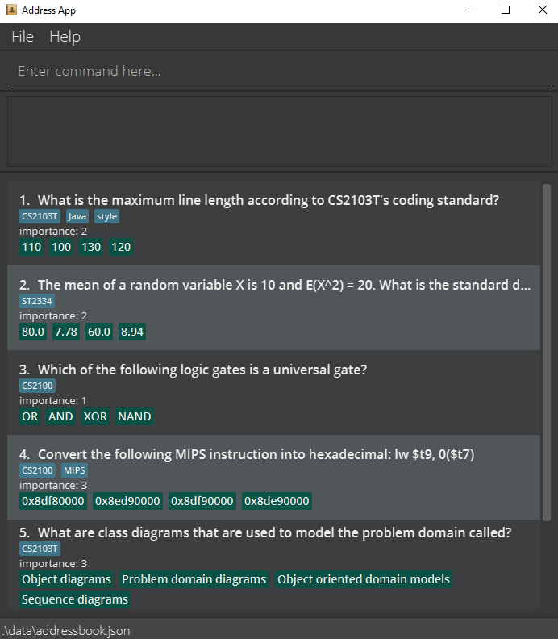
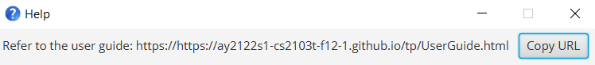

SmartNUS is a **desktop app for students to revise for their exams, optimized for use via a Command Line Interface** (CLI) while still having the benefits of a Graphical User Interface (GUI). If you can type fast, SmartNUS can get your review session more effective and faster than traditional GUI apps.

* Table of Contents
{:toc}

--------------------------------------------------------------------------------------------------------------------

## Quick start

1. Ensure you have Java `11` or above installed in your Computer.

1. Download the latest `smartnus.jar` from [here](https://github.com/AY2122S1-CS2103T-F12-1/tp/releases).

1. Copy the file to the folder you want to use as the _home folder_ for your SmartNUS app.

1. Double-click the file to start the app. The GUI similar to the below should appear in a few seconds. Note how the app contains some sample data. 
   

<!-- 1. Type the command in the command box and press Enter to execute it. e.g. typing **`help`** and pressing Enter will open the help window. 
   Some example commands you can try:

   * **`list`** : Lists all contacts.

   * **`add`**`n/John Doe p/98765432 e/johnd@example.com a/John street, block 123, #01-01` : Adds a contact named `John Doe` to the Address Book.

   * **`delete`**`3` : Deletes the 3rd contact shown in the current list.

   * **`clear`** : Deletes all contacts.

   * **`exit`** : Exits the app. -->

1. Refer to the [Features](#features) below for details of each command.

--------------------------------------------------------------------------------------------------------------------

## Features

**:information_source: Notes about the command format:** 

* Words in `UPPER_CASE` are the parameters to be supplied by the user. 
  e.g. in `mcq qn/QUESTION ans/ANSWER opt/OPTION1 i/IMPORTANCE`, `QUESTION`, `ANSWER`, `OPTION1`, `IMPORTANCE` is a parameter which can be used as `mcq qn/what is 1 + 1? opt/3 opt/1 opt/0 ans/2 i/1`.

<!-- * Items in square brackets are optional. 
  e.g `n/NAME [t/TAG]` can be used as `n/John Doe t/friend` or as `n/John Doe`.
 -->
* Items with `…`​ after them can be used multiple times. 
  e.g. `/opt…​` can be used as `opt/ OPTION1`, `opt/ OPTION1 opt/ OPTION2` etc.

* Parameters can be in any order. 
  e.g. if the command specifies `ans/ ANSWER opt/ OPTION1`, `opt/ OPTION1 ans/ ANSWER` is also acceptable.

<!-- * If a parameter is expected only once in the command but you specified it multiple times, only the last occurrence of the parameter will be taken. 
  e.g. if you specify `p/12341234 p/56785678`, only `p/56785678` will be taken. -->

* Extraneous parameters for commands that do not take in parameters (such as `help`, `list`, `exit` and `clear`) will be ignored. 
  e.g. if the command specifies `help 123`, it will be interpreted as `help`.

## Main Window Commands

### Viewing help : `help`

Shows a message explaning how to access the help page.

Format: `help`

### Add a Multiple Choice Question: `mcq`

Adds a multiple choice question to the question bank.

Format: `mcq qn/QUESTION opt/OPTION1 opt/OPTION2 opt/OPTION3 ans/ANSWER i/IMPORTANCE`

:bulb: **Tip:**
A multiple choice question can have exactly 4 options (1 of the option is an answer)

Examples:
* `mcq qn/what is 1 + 1? opt/3 opt/1 opt/0 ans/2 i/1`

### Add a True False Question: `tf`

Adds a true false question to the question bank.

Format: `tf qn/QUESTION ans/ANSWER i/IMPORTANCE`

:bulb: **Tip:**
A true false question can only have one answer, either "T" or "F"

Examples:
* `tf qn/Is 1+1 = 2 ? ans/T i/1`

<!-- ### Listing all persons : `list`

Shows a list of all questions in the address book.

Format: `list` -->

### Deleting a Question and Answer: `delete`

Deletes an existing question and answer in the question bank.

Format: `delete QUESTION_ID`

* Deletes the question and answer with the specified `QUESTION_ID`.
* The question id refers to the index number shown in the displayed question list. The index **must be a positive integer** 1, 2, 3, …​ -->

### Start a Quiz: `quiz`

Starts a quiz session using all the questions in the question list.

Format: `quiz`

* Opens a new window for the quiz.

Examples:
*  `quiz` Opens a new quiz window and only [quiz commands](#quiz_window_commands) can be used.

### Clearing all entries : `clear`

Clears all entries from the question bank.

Format: `clear`

### Exiting the program : `exit`

Exits the program.

Format: `exit`

## Quiz Window Commands

### Answering a multiple choice question: `a` `b` `c` `d`
Answers the multiple choice question with the options.

Possible options are: `a` `b` `c` or `d`

### Go to the next question: `next`
Navigate to the next question.

Format: `next`

### Go to the previous question: `prev`
Navigate to the previous question.

Format `prev`

### Exit the quiz: `exit`
Exits the quiz.

Format: `exit`

## Data File

### Saving the data

SmartNUS data are saved in the hard disk automatically after any command that changes the data. There is no need to save manually.

### Editing the data file

SmartNUS data are saved as a JSON file `[JAR file location]/data/smartnus.json`. Advanced users are welcome to update data directly by editing that data file.

:exclamation: **Caution:**
If your changes to the data file makes its format invalid, SmartNUS will discard all data and start with an empty data file at the next run.

<!--
### Archiving data files `[coming in v2.0]`

_Details coming soon ..._ -->

--------------------------------------------------------------------------------------------------------------------

## FAQ

**Q**: How do I transfer my data to another Computer? 
**A**: Install the app in the other computer and overwrite the empty data file it creates with the file that contains the data of your previous SmartNUS home folder.

--------------------------------------------------------------------------------------------------------------------

## Main Window Command summary

Action | Format, Examples
--------|------------------
**MCQ** | `mcq qn/QUESTION opt/OPTION1 opt/OPTION2 opt/OPTION3 ans/ANSWER i/IMPORTANCE`   e.g., `mcq qn/what is 1 + 1? opt/3 opt/1 opt/0 ans/2 i/1`
**Delete** | `delete INDEX`  e.g., `delete 3`
**Quiz** | `quiz`  
**Exit** | `exit`  
**Help** | `help`  

## Quiz Window Command Summary

Action | Format, Examples
--------|------------------
**Option a** | `a`  
**Option b** | `b`  
**Option c** | `c`  
**Option d** | `d`  
**Next** | `next`  
**Prev** | `prev`  
**Exit** | `exit`  
