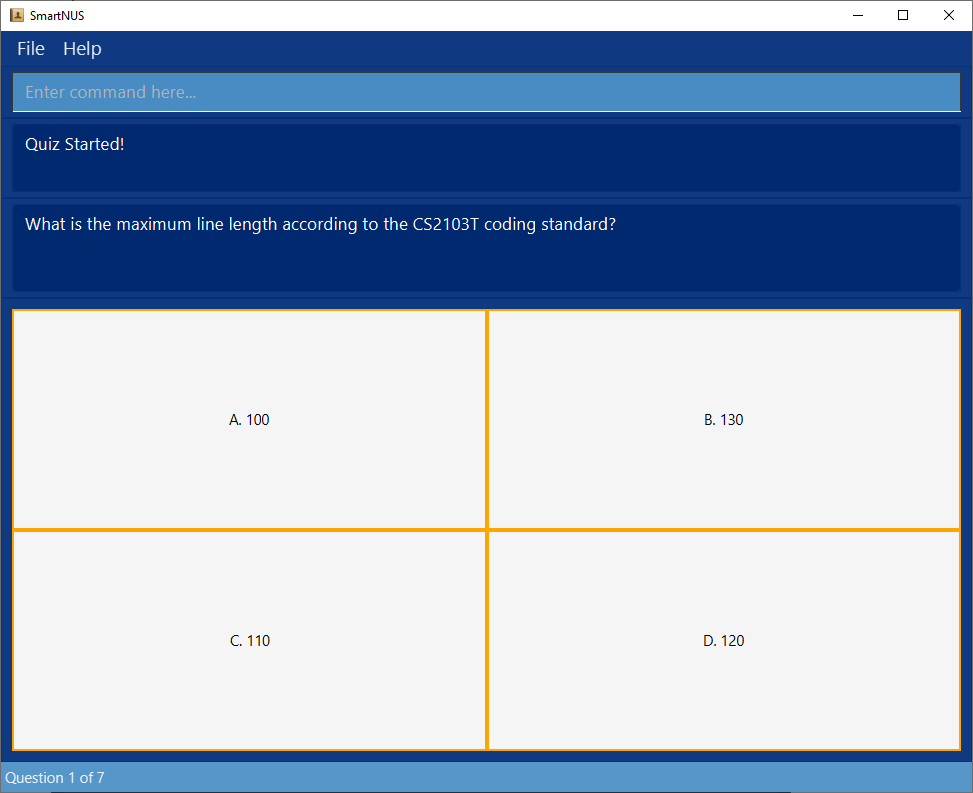
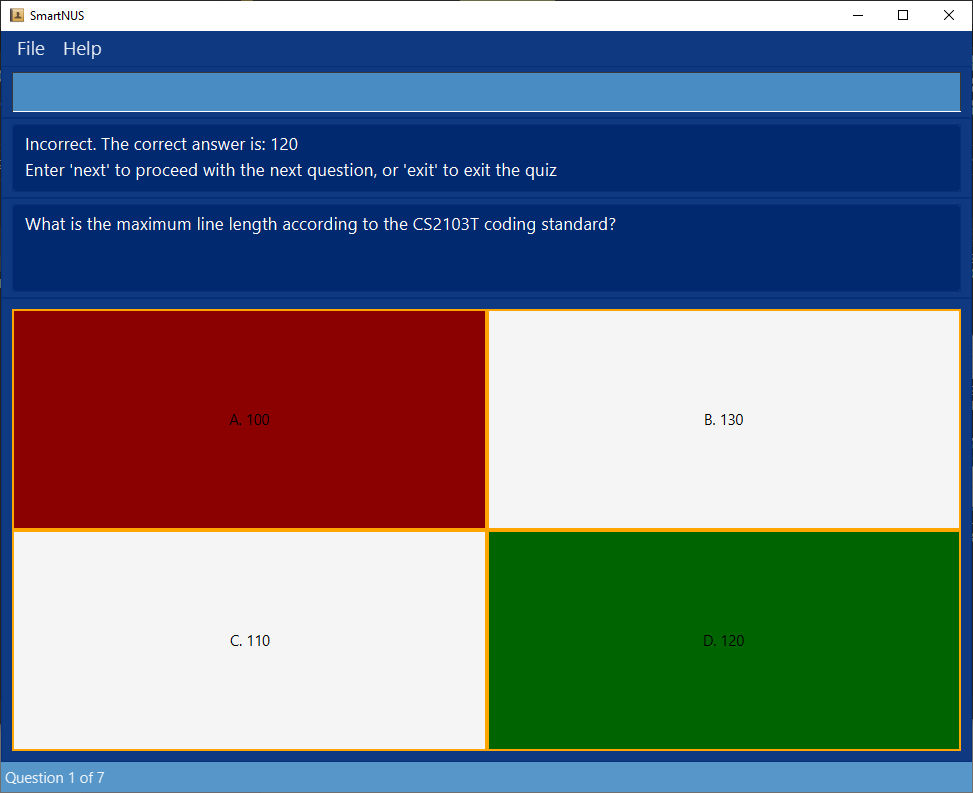
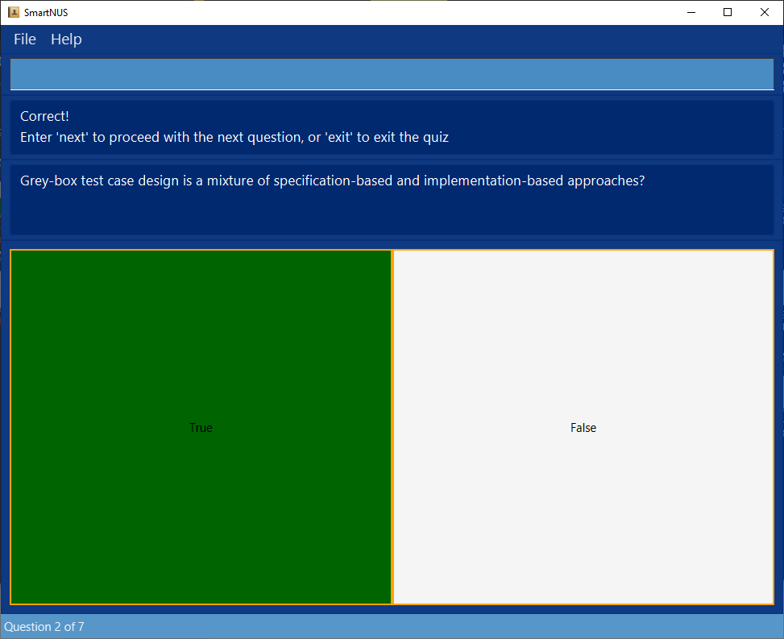
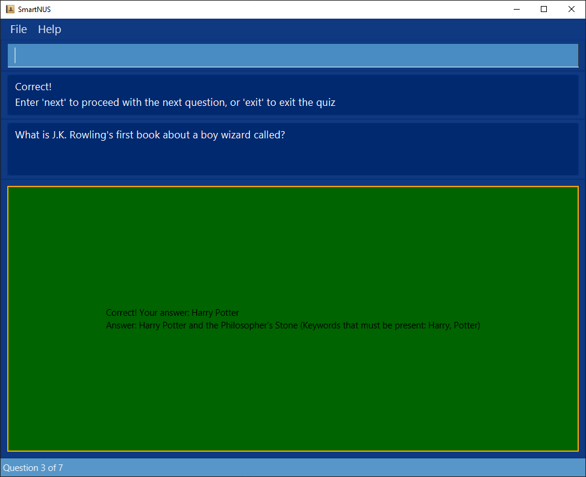

  * Table of Contents
  {:toc}

--------------------------------------------------------------------------------------------------------------------

## 1. Introduction

SmartNUS is a **desktop app for students to revise for their exams, optimized for use via a Command Line Interface** (CLI)
while still having the benefits of a Graphical User Interface (GUI). SmartNUS allows you to create a question bank and
quiz yourself, as well as add notes for revision. If you can type fast, SmartNUS can make your review
sessions more effective and faster than traditional GUI apps.

Interested in using our app? Check out the [Quick Start section](#3-quick-start) to get started!

## 2. About

This section will provide you with the details on how to navigate and interpret the user guide. This guide includes all the features the app provides, with in-depth explanations and examples on how to use them.

### 2.1. Using the User Guide

The user guide has been structured in a way that makes it easy for you to navigate and find what you need.

Here's a quick summary of the available sections in the user guide:

<!-- TODO: Ensure that the numberings below are correct at the end -->
* [Section 1: Introduction](#1-introduction) - Introduction to SmartNUS
* [Section 2: About](#2-about) - About SmartNUS
* [Section 3: Quick Start](#3-quick-start) - A quick start guide to get you started with using SmartNUS
* [Section 4: Features](#4-features) - Documentation of all available features SmartNus has to offer
* [Section 5: FAQ](#5-faq) - Frequently asked questions about SmartNUS
* [Section 6: Command Summary](#6-main-window-command-summary) - Summary of all available SmartNUS commands and formats

### 2.2. Commands

**:information_source: Notes about the command format:** 

* Words in `UPPER_CASE` are the parameters to be supplied by the user. 
  e.g. in `mcq qn/QUESTION ans/ANSWER opt/OPTION1 i/IMPORTANCE`, `QUESTION`, `ANSWER`, `OPTION1`, `IMPORTANCE` is a parameter which can be used as `mcq qn/what is 1 + 1? opt/3 opt/1 opt/0 ans/2 i/1`

* Items in square brackets are optional 
  e.g `qn/QUESTION [t/TAG]` can be used as `qn/What is 1+1? t/math` or as `qn/What is 1+1?`

* Items with `…`​ after them can be used multiple times 
  e.g. `opt/…​` can be used as `opt/ OPTION1`, `opt/ OPTION1 opt/ OPTION2` etc.

* Parameters can be in any order 
  e.g. if the command specifies `ans/ ANSWER opt/ OPTION1`, `opt/ OPTION1 ans/ ANSWER` is also acceptable.

* If a parameter is expected only once in the command but you specified it multiple times, only the last occurrence of the parameter will be taken 
  e.g. if you specify `ans/t ans/abc`, only `ans/abc` will be taken

* Extraneous parameters for commands that do not take in parameters (such as `help`, `exit` and `clear`) will be ignored 
  e.g. if the command specifies `help 123`, it will be interpreted as `help`

* All commands are case-sensitive unless otherwise stated 
  e.g. `help` or `ans/` is acceptable, but `Help` or `Ans/` is not acceptable 

* Parameters *SHOULD NOT* contain any slash "/".

## 3. Quick Start

1. Ensure you have Java `11` or above installed in your Computer

1. Download the latest `smartnus.jar` from [here](https://github.com/AY2122S1-CS2103T-F12-1/tp/releases)

1. Copy the file to the folder you want to use as the _home folder_ for your SmartNUS app

1. Double-click the file to start the app. The GUI similar to the below should appear in a few seconds. Note how the app contains some sample data 
   

Type the command in the command box and press Enter to execute it. e.g. typing **`help`** and pressing Enter will open the help window. 
   Some example commands you can try:

   * **`list question`** : Lists all questions.

   * **`tfq`**`qn/ Is 2+3 = 5? ans/T i/3` : Adds a true false question: `Is 2+3 = 5?` with answer 'true' and importance '3' to SmartNus.

   * **`delete question`**`1` : Deletes the 1st question shown in the current question list. (If the current list being shown is not the question list, enter **`list question`** to display the question list before entering the **`delete question`** `1` command)

   * **`clear`** : Deletes **all** the data in SmartNus.

   * **`exit`** : Exits the app.

Refer to the [Features](#features) below for the details of each command

--------------------------------------------------------------------------------------------------------------------

## 4. Features

This section lists all the commands that SmartNUS supports, with syntax and information about the commands as well as relevant examples.

### 4.1. Main Window Commands

#### 4.1.1. Viewing Help : `help`

Shows a message explaining how to access the help page.

Format: `help`

#### 4.1.2. 4.1.2 Switch between panels : `list`

Format: `list question` OR `list note` OR `list tag`

**Required Parameters:**
* `question` or `note` or `tag` to specify what to list and change the current panel to.

There are 3 different panels in the main window, each showing one of the 3 different entities (`question`, `note`, `tag`) of SmartNus.

You can tell which panel you are on by looking at the bottom left hand corner of SmartNus:

For the above diagram, SmartNus is currently in the `Notes` panel.

Commands that deal with a specific entity can only be run in their own panel. E.g. Commands that operate (adding, editing, deleting) only on questions can only be run in the `Questions` panel.

For more details on which command can run in which panel, refer to the [Main Window Command Summary](#main-window-command-summary)

#### 4.1.3. Add a Question

The following features allow you to add various types of questions to the question bank.

**:information_source: Note:**  
You cannot add a duplicate `Question` to SmartNUS or edit a `Question` to become a duplicate of an existing one.
`Question`s are considered duplicates if they have the same title or question statement.                

##### 4.1.3.1. Add a Multiple Choice Question: `mcq`

Adds a multiple choice question to the question bank.

Format: `mcq qn/QUESTION opt/INCORRECT_OPTION1 opt/INCORRECT_OPTION2 opt/INCORRECT_OPTION3 ans/ANSWER i/IMPORTANCE [t/TAG]`

**Required Parameters:**
* `qn/` The multiple choice question statement
* `opt/` The incorrect choices. Exactly 3 inputs in total.
* `ans/` The correct choice. Exactly 1 input in total.
* `i/` The importance of the question for the user. An integer between 1 and 3. 3 signifies the highest importance and 1 signifies the lowest importance.

**Optional Parameters:**
* `t/` The tags of the question. Tags must be a single alphanumeric word.

:bulb: **Tip:**
A multiple choice question must have exactly three incorrect options and one correct answer.

Examples:
* `mcq qn/What is 1 + 1? opt/3 opt/1 opt/0 ans/2 i/1`
  * creates a new MCQ question:
    * What is 1 + 1?
      * A. 3
      * B. 1
      * C. 0
      * D. 2 (correct)

      having importance 1.

* `mcq qn/What is 1 + 5? opt/3 opt/1 opt/0 ans/12 ans/6 i/2`
  * creates a new MCQ question:
    * What is 1 + 1?
      * A. 3
      * B. 1
      * C. 0
      * D. 6 (correct)
  
      having importance 2.

##### 4.1.3.2. Add a True False Question: `tfq`

Adds a true false question to the question bank.

Format: `tfq qn/QUESTION ans/ANSWER i/IMPORTANCE [t/TAG]`

**Required Parameters:**
* `qn/` The TF Question statement
* `ans/` The correct choice. 1 in total, can only be either true or false
* `i/` The importance of the question for the user. An integer between 1 and 3. 3 signifies the highest importance and 1 signifies the lowest importance

**Optional Parameters:**
* `t/` The tags of the question. Tags must be a single alphanumeric word.

Caveat:
* Each true false question can only have one answer, indicated by using "T" for true, and "F" for false.

:bulb: **Tip:**
"T" or "F", which is used to indicate the answer to the true false question, is case-insensitive.

Examples:
* `tfq qn/2*2 = 5? ans/F i/3` : 2*2 = 5? False
* `tfq qn/Is CS2103T a fun module? ans/t i/2`: Is CS2103T a fun module? True
* `tfq qn/Will entering multiple valid answers create problems? ans/t ans/f i/2`: Will entering multiple valid answers create problems? False

##### 4.1.3.3. Add a Short Answer Question: `saq`

Adds a short answer question to the question bank.

Format: `saq qn/QUESTION ans/ANSWER INCLUDING KEYWORDS k/KEYWORD... i/IMPORTANCE [t/TAG]...`

**Required Parameters:**
* `qn/` The SA Question statement.
* `ans/` The correct answer. 1 in total.
* `k/` The keywords for evaluating the answer. **Need to be included inside the `ans/` parameter.**
* `i/` The importance of the question for the user. An integer between 1 and 3. 3 signifies the highest importance and 1 signifies the lowest importance.

**Optional Parameters:**
* `t/` The tags of the question. Tags must be a single alphanumeric word.
 

* Each short answer question must have exactly one answer.
* The answer must include at least one keyword which is specified using `k/` (e.g. `ans/k/powerhouse of the k/cell`).
* Note that keywords **MUST be specified within the answer** to be recognised as keywords
  * `qn/my question? k/KEYWORDOUTSIDEANSWER ans/my answer i/2` is an invalid command
  * See examples given below for valid commands to try out.
* Keywords are stored in lowercase. Specifying `k/ABC` and `k/abc` both result in "abc" being stored as the keyword. However,
  the answer will be displayed with the correct case ("ABC" and "abc" respectively)
* During a [quiz](#start-a-quiz-quiz), any answer that contains all the keywords (case-insensitive)
  in any order is considered correct (e.g. "DatAstrUcturesandalgorithms" will be a correct answer
  to a question whose keywords are "structure" and "data")
* Keywords are made up of alphanumeric characters.
  When specifying a keyword that includes non-alphanumeric characters
  (e.g. `k/"harry, !'abc@#^e,y?`), only the first valid part of the word
  (continuous string of alphanumeric characters) will be taken as the keyword i.e. "harry".

Examples:
* `saq qn/What does mRNA stand for? ans/k/messenger k/ribonucleic k/acid i/1`
* `saq qn/Who wrote The Merchant of Venice? ans/William k/Shakespeare i/2 t/literature t/classics`
* `saq qn/You're a wizard, Harry. Which book is this quote from? ans/k/Harry k/Potter and the Philosopher's Stone i/2`
  * Answer is displayed as "Harry Potter and the Philosopher's Stone".
  * During a [quiz](#start-a-quiz-quiz):
    * Correct answers include "haRRy PoTtEr", "Harry Potter and the Philosopher's Stone",
      "potter harry", "harrypotter" and "wordthatincludesharryandpotter"
    * Incorrect answers include "Potter" and "harr pottery"

#### 4.1.4. Add notes: `note`
Adds a note to the note list.
Format: `note note/NOTE`

**Required Parameters:**
* `note/` The note statement

Notes accept all text and numbers.

**Required Parameters:**
* `question` or `note` or `tag` to specify what to list
#### 4.1.5. Delete a Question or Note: `delete`

Deletes an existing question or note from the question bank or note list.

Format: `delete question QUESTION_INDEX` OR `delete note NOTE_INDEX`

**Required Parameters:**
* `question` and `QUESTION_INDEX`

OR

*  `note` and `NOTE_INDEX`

Deletes the question or note with the specified `QUESTION_INDEX` or `NOTE_INDEX`, if the index is valid.

The `QUESTION_INDEX` or `NOTE_INDEX` refers to the index number shown in the displayed list.
* A valid index is:
  * **a positive integer** between 1 and 2147483647 (both inclusive)
  * Equal to or smaller than the number of items in the list. Eg. If a list contains 5 questions, `6` is not a valid index but `3` is.

#### 4.1.6. Edit a Question and Answers: `edit`

Edits an existing question in the question bank with the specified question number.

Format: `edit QUESTION_ID [qn/QUESTION] [t/TAG]... [ans/CORRECT_ANSWER] [opt/INCORRECT_OPTION]... [i/IMPORTANCE]`

**Required Parameters**
* `QUESTION_ID` refers to the index number shown in the displayed question list.

* A valid index is:
  * **a positive integer** between 1 and 2147483647 (both inclusive)
  * Equal to or smaller than the number of items in the list. Eg. If a list contains 5 questions, `6` is not a valid index but `3` is.

**Optional Parameters**
* `qn/` The new question statement
* `t/` The new question tags
* `ans/` The new correct answer
* `opt/` The new incorrect options (if question is a `MCQ`)
* `i/`The new importance

* At least one of the optional fields must be provided.
* Existing values will be updated to the input values.
* You cannot edit question type (e.g. cannot edit a Multiple Choice Question to a True False Question)

* Edit Tags
  * When editing tags, the existing tags of the question will be removed i.e adding of tags is not cumulative
  * You can remove all the question’s tags by typing `t/` without specifying any tags after it

* Edit Answers/Options
  * If editing the answers of a question, all option(s) and answer(s) must be valid for the type of question being edited
  * Multiple Choice Question: Specify all three incorrect options (`opt/`) and one correct answer (`ans/`)
  * True/False Question: Only specify the correct answer (`ans/`), which must be “T” or “F”
  * Short Answer Question: Only specify the correct answer (`ans/`) which must include at least one keyword (`k/`)

Examples:
* Multiple Choice Question (MCQ): `edit 1 opt/1 opt/2 opt/3 ans/4 t/` sets the incorrect options to 1, 2, and 3,
  and the correct answer to 4, and removes all the tags from Question 1 if it is an MCQ.
* True/False Question (TFQ): `edit 2 ans/T` sets the answer of Question 2 to True if it is a TFQ.
* Short Answer Question (SAQ): `edit 3 ans/k/powerhouse of the k/cell t/CS2100`
  sets the answer of Question 3 to powerhouse of the cell, with keywords "powerhouse" and "cell",
  and replaces all tags with CS2100 if Question 3 is an SAQ.

:bulb: **Tip:**

If you were previously in a filtered view (e.g. after running the `find CS2100` command),
and your edited question no longer matches this filter (e.g. question title no longer contains "CS2100"),
your edited question will not be shown on-screen. To see a list of all questions,
run the `list question` command.

#### 4.1.7. Find/Search Questions: `find`

Shows a list of all questions in SmartNUS that have all the specified keywords in their titles,
at least one of the specified tags, and the importance value (if specified).

Format: `find [KEYWORDS]... [t/TAG]... [i/IMPORTANCE]`

**Parameters**
* `KEYWORDS` The specific keyword(s) to be searched
* `TAG` The specific tag(s) to be searched
* `IMPORTANCE` The importance to be searched

* **At least** one of the optional fields to find by must be specified.
* If `KEYWORDS` are specified, they must be specified before any tags and importance.
* The search is case-insensitive for both keywords and tags (e.g. `math` will match `MaTH`).
* Only full words will be matched for both keywords and tags (e.g. `CS2100` will not match `CS210`).
* The following characters `,.?!:;*"()[]{}` which are commonly used to separate words are not considered part of a word or keyword.
  Instead, they are considered as word separators similar to a space.
  * `find *("literature":,;?!)]}` returns the same result as `find literature`.
  * `find ,:;?(]` is an invalid command as it is the same as finding a blank keyword or only inputting spaces as keywords.
  * `find first? second (third...)!` is the same as `find first second third`.
* Hyphenated words are considered as one word (e.g. `find grey-box` will not return a question titled `grey box`).
* Any question that has at least one of the tags **AND** all the keywords in its title (in any order)
  **AND** the importance specified will be listed.

:bulb: **Tip:**
You can search for more than one tag or keyword.

:bulb: **Tip:**

To return to the list of all questions, use the `list question` command.

Examples:
* `find load word t/CS2100 t/MIPS i/2` returns questions tagged with at least one of the tags, with importance value 2 and whose title
  includes "load" and "word" in any order.
  * e.g. A question titled "What is the load word instruction used for?" tagged with only CS2100 and with an importance value of 2 will be listed.
* `find java` returns a question titled "How do you output text to the console in Java?" but not a question titled "Javascript is commonly used in web development. True or false?" (since `java` is not a full word match for `javascript`).

#### 4.1.8. Find/Search Stats: `stat`

Shows the list of statistics by Tag for the questions attempted.

The total number of attempts and correct attempts for questions under each tag will be shown. 

Format: `stat [t/TAG]...`

**Parameters**
* `TAG` The specific tag(s) to be searched

Caveats:
* The search is case-insensitive for tags
* Only full words will be matched (e.g. `CS2100` will not match `CS210`)
* Statistics for any of the tags passed in will be shown
* If no parameters are passed in, it will show all statistics
* For questions that have multiple tags, SmartNus will count its attempts and correct attempts under all its tags.

Examples:
* `stat t/CS2100 t/MIPS` returns the overall statistics for the questions tagged with `CS2100` or `MIPS` or both.

<!-- TODO: add brief description before format to standardise format-->
#### 4.1.9. Start a Quiz: `quiz`
Format: `quiz [lim/ LIMIT] [t/TAG]... [n/INDEX...]`

**Optional Parameters**
* `lim/` positive, non-zero integer that will limit the number of questions in the quiz.
* `t/` quiz will be formed from questions with the specified tag. If such a tag does not exist, quiz will not start.
* `n/` quiz specific questions - `INDEX` refers to the index number shown in the displayed question list.
  * Multiple indexes can be entered, with a space between them. (e.g. `n/ 1 2 3`)
* If no parameters are passed, a quiz session will be created using all the questions in the question list.
* TAG can be used to filter the quiz to only give questions with the tags specified, works with limit.
* INDEX can be used to filter the quiz to only give questions with the specified question numbers. Does not work with tag or limit.
  The index **must be a positive integer** from 1 to 2147483647

* A valid index is:
  * **a positive integer** between 1 and 2147483647 (both inclusive)
  * Equal to or smaller than the number of items in the list. Eg. If a list contains 5 questions, `6` is not a valid index but `3` is.

* A valid limit is:
  * **a positive integer** between 1 and 2147483647 (both inclusive)
  * Eg. If SmartNus contains 5 questions, `6` is a valid limit but only `5` questions will be shown in the quiz.

Examples:
* `quiz lim/5 t/CS2100 t/MIPS` quiz will select questions tagged with at least one of the tags, limited to 5 questions.
* `quiz n/1 2 3` quiz will select the questions with index number 1 2 3.

Expected Outcome:

#### 4.1.12. Clear All Entries : `clear`

Clears all entries (questions, notes and tags) from the question bank.

Format: `clear`

#### 4.1.11. Exit the Program : `exit`

Exits the program.

Format: `exit`

#### 4.1.12. Change the Theme: `theme`

Changes the theme of the app.

Format: `theme THEME`

##### 4.1.12.1. Parameters:
- `THEME`: can only be `light` or `dark`

Examples:
- `theme light`: Sets the theme to light
- `theme dark`: Sets the theme to dark

### 4.2. Quiz Window Commands

#### 4.2.1. Answer a Multiple Choice Question: `A` `B` `C` `D`
Answers the multiple choice question with the options.

Format: `A` `B` `C` `D` (case-insensitive)

Examples:
- `A`: Answers the multiple choice question with option 'A'

Expected Outcome:

#### 4.2.2. Answer a True False Question: `T` `F`
Answers the multiple choice question with the options.

Format: `T` `F` `True` `False` (case-insensitive)

Examples:
- `T`: Answers the multiple choice question with option 'True'
- `True`: Answers the multiple choice question with option 'True'

Expected Outcome:

#### 4.2.3. Answer a Short Answer Question: `ans/`
Answers the short answer question with the provided answer.
All text after the first instance of `ans/` is taken as the intended answer.

Format: `ans/ANSWER`

Examples:
* `ans/Harry Potter`: Answers the short answer question with "Harry Potter".

Expected Outcome:

#### 4.2.4. Go to the Next Question: `next`
Navigate to the next question.

Format: `next`

#### 4.2.5. Go to the Previous Question: `prev`
Navigate to the previous question.

Format `prev`

#### 4.2.6. Exit the Quiz: `exit`
Exits the quiz.

Format: `exit`

--------------------------------------------------------------------------------------------------------------------

## 5. FAQ

**Q**: How do I save my data? 
**A**: SmartNUS data are saved in the hard disk automatically after any command that changes the data. There is no need to save manually.

**Q**: How do I transfer my data to another Computer? 
**A**: Install the app in the other computer and overwrite the empty data file it creates with the file that contains the data of your previous SmartNUS home folder.

**Q**: Am I allowed to edit the data file directly? 
**A**: SmartNUS data are saved as a JSON file `[JAR file location]/data/smartnus.json`. Advanced users are welcome to update data directly by editing that data file.

:exclamation: **Caution:**
If your changes to the data file makes its format invalid, SmartNUS will discard all data and start with no data.

--------------------------------------------------------------------------------------------------------------------

## 6. Command Summary
<!-- TODO: Ensure that all commands are added below -->
### 6.1. Main Window Command Summary

Action | Format, Examples | Which Panel? |
--------|------------------|-------------
**MCQ** | `mcq qn/QUESTION opt/OPTION1 opt/OPTION2 opt/OPTION3 ans/ANSWER i/IMPORTANCE`   e.g., `mcq qn/what is 1 + 1? opt/3 opt/1 opt/0 ans/2 i/1` | question
**TFQ** | `tfq qn/QUESTION ans/ANSWER i/IMPORTANCE`   e.g., `mcq qn/Is 1 + 1 = 2? ans/t i/1` | question
**SAQ** | `saq qn/QUESTION ans/ANSWER INCLUDING KEYWORDS k/KEYWORD... i/IMPORTANCE [t/TAG]...`   e.g., `saq qn/what is Shakespeare's first name? ans/k/William i/1` | question
**Note** | `note note/NOTE`   e.g., `note note/This is a note` | note
**Delete** | `delete question QUESTION_INDEX` OR `delete note NOTE_INDEX`  e.g., `delete question 1`, `delete note 2` | question or note
**Edit** | `edit QUESTION_ID [qn/QUESTION] [t/TAG]... [ans/CORRECT_ANSWER] [opt/INCORRECT_OPTION]... [i/IMPORTANCE]`   e.g., `edit 1 qn/Who wrote Pride and Prejudice? i/3 t/literature`   | question
**Find** | `find [KEYWORDS]... [t/TAG]... [i/IMPORTANCE]`   e.g., `find load word t/CS2100 t/MIPS i/2` | question
**Stat** | `stat [t/TAG]...`   | tag
**Quiz** | `quiz [lim/ LIMIT] [t/TAG]... [n/INDEX...]`   | question
**Theme** | `theme light` or `theme dark`   | all
**List** | `list question` or `list note` or `list tag`   | all
**Clear** | `clear`   | all
**Exit** | `exit`   | all
**Help** | `help`   | all

### 6.2. Quiz Window Command Summary

Action | Format, Examples
--------|------------------
**Option A** | `A`  
**Option B** | `B`  
**Option C** | `C`  
**Option D** | `D`  
**Option True** | `T`, `True` (Case-insensitive)  
**Option False** | `F`, `False` (Case-insensitive)  
**SAQ Answer** | `ans/ANSWER`  e.g., `ans/Harry Potter`  
**Next** | `next`  
**Prev** | `prev`  
**Exit** | `exit`  
